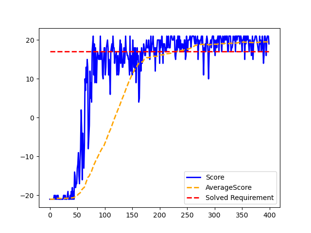
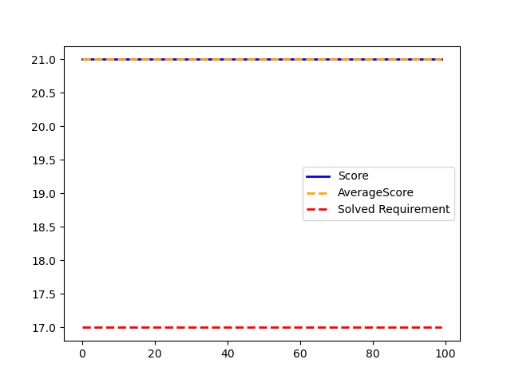

# OpenAI Pong-v4 DeepRL-based solutions
Using Deep Q-Network (DQN), Dueling DQN, and Dueling Double DQN (D3QN)  

Investigation under the development of the master thesis "DeepRL-based Motion Planning for Indoor Mobile Robot Navigation" @ Institute of Systems and Robotics - University of Coimbra (ISR-UC) 

# Software/Requirements
Module | Software/Hardware
------------- | -------------
Python IDE | Pycharm
Deep Learning library | Tensorflow + Keras
GPU | GeForce MX 250
Interpreter | Python 3.8
Python Environment | Anaconda
Packages | requirements.txt

**To setup Pycharm + Anaconda + GPU, consult the setup file [here](setup.txt)**.  
**To import the required packages, [requirements.txt](DQN/requirements.txt), type the following instruction in the project environment terminal:**  
> pip install -r requirements.txt

# :warning: **WARNING** :warning:  
The training generates a [.txt file](DQN/saved_networks.txt) that tracks the network models (in 'tf' and .h5 formats) that achieved the solved requirement of the environment. Additionally, an overview image (graph) of the training procedure is created.   
Keep in mind that to perform several training processes, the .txt, .png, and directory names must be change. Otherwise, information of previous trainings will get overwritten, and lost.  

Regarding testing, if you choose to load the .h5 model, a 5 episode training is done to initialize/build the keras.model network. Thus, the warnings above mentioned are also appliable to this situation.   
Loading the saved model in 'tf' is the recommended option. After finishing the testing, an overview image (graph) of the training procedure is also generated.  

# OpenAI Atari Pong-v4
**Actions:** 
0 - Push cart to the left    
1 - Push cart to the right

**States:** 
0 - Cart position  
1 - Cart velocity  
2 - Pole angle  
3 - Pole velocity at tip

**Rewards:** 
Scalar value (1) for every step taken

**Episode termination:**   
12° < Pole angle (State 2) < -12°  
2.4 < Cart position (State 0) < -2.4  
Episode length > 200  

**Solved Requirement:** 
Average reward of 195.0 over 100 consecutive trials

# Deep Q-Network (DQN)

  

<table>
<tr><th> Train </th><th> Test </th></tr>
<tr><td>

| Parameter | Value |
|--|--|
| Number of episodes | 400 |
| Learning rate  | 0.0001 |
| Discount Factor | 0.99 |
| Epsilon | 1.0 |
| Batch size | 32 |
| TargetNet update rate (steps) | 100 |
| Actions (Pong-v4 env) | 6 |
| States (Pong-v4 env) | (4, 80, 80) |

</td><td>

| Parameter | Value |
|--|--|
| Number of episodes | 100 |
| Epsilon | 0.01 |
| Actions (Pong-v4 env) | 6 |
| States (Pong-v4 env) | (4, 80, 80) |

</td></tr> </table>

  
  

  
  

> **Network model used for testing:** 'saved_networks/dqn_model10' ('tf' model, also available in .h5)  
